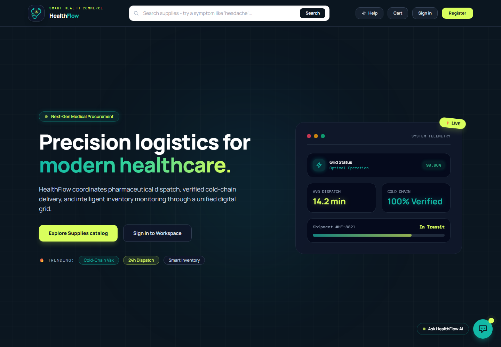
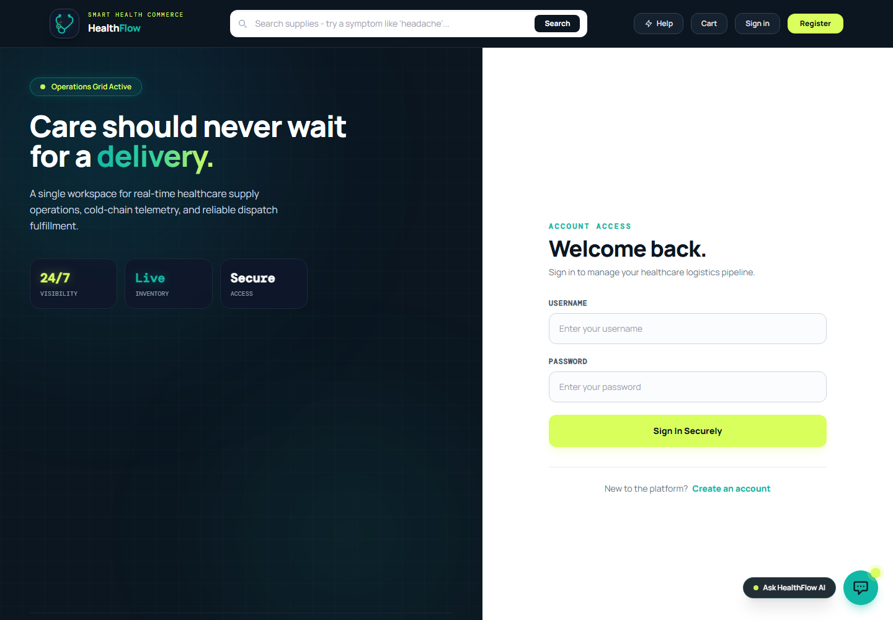
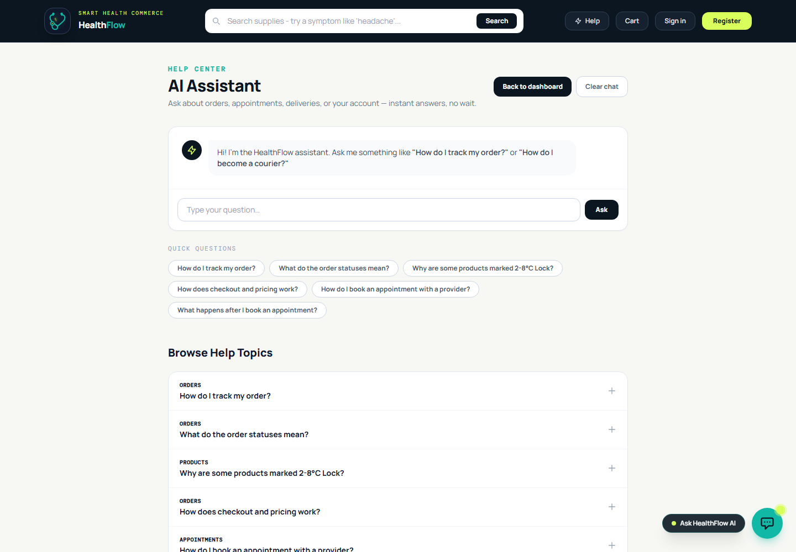
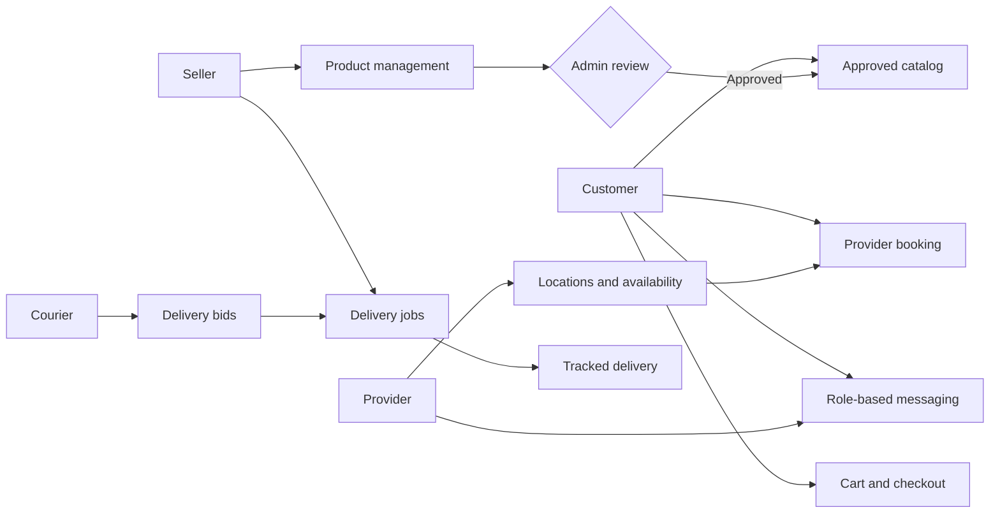

<div align="center">

# HealthFlow

### Smart health commerce, care coordination, and last-mile delivery in one workspace

[](https://www.python.org/)
[](https://www.djangoproject.com/)
[](https://www.sqlite.org/)
[](#testing)

HealthFlow connects patients, healthcare providers, medical suppliers, couriers, and administrators through role-specific workflows for purchasing, appointments, messaging, and delivery.

</div>



## Overview

HealthFlow is a multi-role healthcare operations platform built with Django. Customers can discover approved medical products, book providers, place orders, and manage conversations. Sellers maintain inventory and arrange deliveries, providers manage appointments and patients, couriers bid on delivery jobs, and administrators govern marketplace listings.

The application also includes an AI-assisted help center and semantic product search. Both can use a Groq-compatible API when configured, while the help center retains a local knowledge-base fallback.

## Core capabilities

| Area | Capabilities |
| --- | --- |
| Customers | Product discovery, AI-assisted search, cart and checkout, provider booking, appointment cancellation, order history, profile settings, and messaging |
| Providers | Practice locations, recurring availability, capacity-aware appointment scheduling, patient lists, appointment status management, and patient messaging |
| Sellers | Product and inventory management, approval tracking, order visibility, delivery job creation, courier bid selection, and customer messaging |
| Couriers | Open-job discovery, delivery bidding, bid withdrawal, assigned-delivery tracking, and status progression |
| Administrators | Operational dashboard, user and marketplace oversight, and product approval or rejection |
| Platform | Role-based routing, secure Django authentication, attachment-aware conversations, stock-safe checkout, and responsive interfaces |

## Product tour

<table>
  <tr>
    <td width="50%">
      
      <br><strong>Role-aware access</strong><br>
      One authentication flow routes each user to the appropriate workspace.
    </td>
    <td width="50%">
      
      <br><strong>AI-assisted support</strong><br>
      Guided answers for orders, appointments, deliveries, products, and accounts.
    </td>
  </tr>
</table>

## Workflow



## Technology

- **Backend:** Python 3.11, Django 5.2
- **Data:** Django ORM and SQLite for local development
- **Frontend:** Django templates, Tailwind CSS via CDN, vanilla JavaScript, and HTMX-enhanced navigation
- **AI integration:** Groq-compatible chat completions through `requests`
- **Content safety:** Markdown rendering with Bleach sanitization
- **Authentication:** Django sessions, password validation, and role-based dashboard routing
- **Testing:** Django `TestCase` suite

## Project structure

```text
aiep_backend/
|-- accounts/           # Authentication, profiles, dashboards, bookings, and role views
|-- ai_communication/   # AI assistant, local knowledge base, and semantic search
|-- catalog/            # Products, categories, provider availability, and appointments
|-- messaging/          # Conversations, messages, attachments, and visibility controls
|-- orders/             # Cart, checkout, orders, courier jobs, bids, and deliveries
|-- aiep_backend/       # Django project configuration and root URL routing
|-- docs/screenshots/   # README product screenshots
|-- manage.py
`-- requirements.txt
```

## Getting started

### Prerequisites

- Python 3.11 or newer
- Git

### 1. Clone the repository

```bash
git clone https://github.com/Rub-Shefa/AIEP.git
cd AIEP
```

### 2. Create and activate a virtual environment

Windows PowerShell:

```powershell
python -m venv .venv
.\.venv\Scripts\Activate.ps1
```

macOS or Linux:

```bash
python3 -m venv .venv
source .venv/bin/activate
```

### 3. Install dependencies

```bash
python -m pip install --upgrade pip
pip install -r requirements.txt
```

### 4. Configure optional AI access

Create a local `.env` file in the project root when external AI responses are required:

```dotenv
AI_API_KEY=your_api_key
AI_API_URL=https://api.groq.com/openai/v1/chat/completions
AI_MODEL=openai/gpt-oss-120b
```

`AI_API_KEY` is optional. Without it, the help center continues to answer supported questions from its built-in knowledge base.

### 5. Initialize the database

```bash
python manage.py migrate
python manage.py createsuperuser
```

### 6. Start the development server

```bash
python manage.py runserver
```

Open [http://127.0.0.1:8000](http://127.0.0.1:8000) and register role-specific accounts as needed. Use `/admin/` with the superuser account for administrative data management.

## Testing

Run the complete test suite:

```bash
python manage.py test
```

Useful project checks:

```bash
python manage.py check
python manage.py makemigrations --check --dry-run
```

The current suite covers AI assistant behavior, approval-aware checkout, stock preservation, appointment capacity, and appointment serial assignment.

## Key safeguards

- Only administrator-approved products can be added to a cart or purchased.
- Checkout revalidates product approval and inventory inside a database transaction.
- Appointment confirmation locks availability while checking capacity and assigning serial numbers.
- Users can access only conversations and records associated with their accounts.
- Assistant-generated Markdown is sanitized before being rendered as HTML.
- Secrets, local databases, uploaded media, virtual environments, and editor settings are excluded from version control.

## Development notes

- SQLite is configured for local development. Use a production-grade database and deployment settings before hosting the application publicly.
- Payment options and wallet flows are simulated; no real payment gateway is connected.
- The assistant provides platform guidance and is not a substitute for professional medical advice.
- Uploaded files are stored locally under `media/` during development and are intentionally not committed.

## Contributing

1. Create a branch from `main`.
2. Keep changes focused and include tests for behavioral changes.
3. Run the test suite and Django checks before opening a pull request.
4. Use clear, conventional commit messages such as `feat(catalog): add inventory filters` or `fix(orders): prevent invalid checkout`.

---

<div align="center">
Built as an integrated healthcare commerce and coordination platform.
</div>
